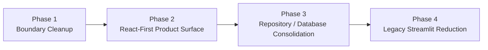

# React Migration Plan

Date: `2026-04-04`

## Decision

Continue the current migration.

Do not rewrite from zero.

## Goal

Turn the current mixed dashboard into a stable product-shaped stack:

- React as the primary user interface
- FastAPI as the single UI backend
- shared payload contracts for both React and Streamlit
- database-backed operational state
- research artifacts still usable during migration

## Phase Overview



## Phase 1: Boundary Cleanup

Status: `completed`

### Objective

Stop layer leakage before adding more features.

### Scope

- move non-render helper logic out of `src/app/pages/`
- keep page modules render-focused
- keep facade modules page-payload-focused
- keep tests aligned with the new boundaries

### Done In This Pass

- added `src/app/viewmodels/`
- moved helper logic for:
  - overview
  - factor explorer
  - model backtest
  - candidates
- ai review
- switched `dashboard_facade` to import from viewmodels instead of page modules
- switched page helper tests to import from viewmodels
- added `src/app/repositories/holding_repository.py` so holding snapshots no longer read report/data files inside the service layer
- updated `src/app/services/holding_snapshot_service.py` to consume repository contracts only
- tightened `src/app/repositories/config_repository.py` so explicit temp roots no longer read from or write to shared database-backed config state
- moved AI review response summary loading into `dashboard_facade`, so the Streamlit payload page only renders preloaded payload data
- removed the `render_ai_review_payload_page` file-read dependency from `streamlit_app.py`
- verified that active `src/app/services/` modules no longer perform direct file reads for dashboard payload assembly

### Exit Criteria Reached

1. shared payload helpers are no longer owned by `src/app/pages/`
2. facade payload assembly does not depend on page modules
3. service-layer holding snapshot assembly reads through repositories
4. explicit test roots are isolated from shared database config
5. payload render paths consume preloaded data instead of reading raw artifact paths

## Phase 2: React-First Product Surface

Status: `in progress`

### Objective

Make React the clear primary operator experience.

### Scope

1. move all new user-facing improvements to `web/`
2. keep route-level page contracts stable
3. continue reducing first-screen noise and mixed responsibilities
4. unify page actions around API endpoints only

### Started In This Pass

- added `/api/home` as a dedicated operator-home payload
- changed React `/` from research overview to a true operator home page
- moved research overview to `/overview`
- updated the shared React shell navigation so home, advanced workbench, research pages, and service page are clearly separated
- added a React `HomePage` that brings together:
  - current service/realtime state
  - quick operator actions
  - focus watchlist list
  - candidate list
  - AI inference list
  - latest action result
- added in-process caching for the home payload and wired it into the existing dashboard cache-clear path so the operator home stays fast after warm-up
- added a database-backed `watchlist_snapshot` artifact so cold-start watchlist assembly no longer has to rebuild from raw reports every time
- updated the repository/service chain so `build_watchlist_base_frame()` prefers the stored watchlist snapshot and only falls back to rebuilding when the artifact is missing
- added a lazy write-through path so the first rebuild persists a fresh snapshot back to PostgreSQL for later process starts
- measured the cold-start gain after landing the snapshot artifact:
  - `build_watchlist_base_frame()` dropped from about `85.6s` to about `0.175s`
  - `get_home_payload()` cold load dropped from about `18.4s` to about `7.2s`
  - `get_watchlist_payload()` cold load dropped from about `17.0s` to about `5.9s`
- split the candidates page into `summary first / history later` contracts:
  - added `/api/candidates/summary`
  - added `/api/candidates/history`
  - kept `/api/candidates` as a compatibility path that still returns the combined payload
- added database-backed candidate snapshot artifacts for each `model/split` pair and wired the summary path to prefer those snapshots
- added lazy write-through candidate snapshot persistence so missing summary artifacts are rebuilt once and then reused
- updated the React candidates page to fetch the top-list summary first and load score history as a second query instead of blocking the whole page on both
- measured the next round of gains after landing candidate summary snapshots:
  - `/api/candidates/summary` responded in about `15ms`
  - `/api/home` dropped again to about `1.9s`
  - `/api/candidates/history` still costs about `5.8s`, but it now sits on the detail path instead of the first-screen summary path
- split the factor explorer page into `summary first / detail later` contracts:
  - added `/api/factors/summary`
  - added `/api/factors/detail`
  - kept `/api/factors` as a compatibility path that still returns the combined payload
- added a database-backed `factor_explorer_snapshot` artifact so factor ranking and missing-rate summaries can load from PostgreSQL instead of rebuilding from the full feature panel every time
- updated the React factor explorer page to load ranking/missing-rate summary first and request symbol history separately
- measured the factor summary path after this pass:
  - `/api/factors/summary` responded in about `59ms`
  - `/api/factors/detail` responded in about `0.867s`
  - the detail cost is now isolated to the single-symbol history path instead of the first-screen summary path
- added a short-lived cached service summary for `/api/service` and `/api/shell` so the primary operator shell no longer repeats the same runtime status assembly on each request
- measured the service summary path after this pass:
  - `/api/service` first request about `28ms`
  - `/api/service` repeated request about `18ms`
  - `/api/shell` about `8ms`
- split the AI review page into `summary first / detail later` contracts:
  - added `/api/ai-review/summary`
  - added `/api/ai-review/detail`
  - kept `/api/ai-review` as a compatibility path for the combined payload
- changed the operator home to use AI review summaries only, so the home payload no longer carries AI detail-layer fields that the home UI does not render
- rewrote the React `AI 研判` and `主操作台` pages to better enforce the `总列表 -> 个体详情` rule:
  - candidate tables now appear before single-stock spotlight summaries
  - long markdown, external model responses, and full field tables are pushed into collapsible secondary sections
  - home support blocks like system snapshot details and latest action logs are now collapsed behind secondary sections instead of competing with the first screen
- measured the AI review paths after this pass:
  - `/api/ai-review/summary` about `9ms`
  - `/api/ai-review/detail?scope=inference` about `27ms`
  - `/api/ai-review/detail?scope=historical` about `128ms`
  - `/api/home` warm path about `5ms`

### Success Criteria

- no new operator feature requires Streamlit first
- React pages cover the full daily workflow
- action feedback and realtime status remain consistent across pages

### 2026-04-04 Progress Update

- home, watchlist, candidates, factor explorer, and AI review now follow `summary first / detail later`
- operator home cold-start noise has been reduced by moving AI detail and support blocks behind summary contracts
- overview, service, workspace, home, AI review, and candidates now share a consistent support-layer treatment
- watchlist, factor explorer, and backtests now also move support-heavy explanations behind the same support-layer treatment
- panel subtitles, section descriptions, filter-bar guidance, and context helpers are now being compressed into a thinner secondary copy layer
- React verification is green on `build + lint + route smoke`

## Phase 3: Repository / Database Consolidation

Status: `in progress`

### Objective

Reduce mixed file/database reads by formalizing storage ownership.

### Scope

1. identify each payload’s source of truth
2. route persistence through repositories/stores
3. keep file-based research outputs where useful, but access them through repository contracts
4. continue syncing operational datasets into PostgreSQL when they benefit UI performance or stability

### Success Criteria

- page payloads no longer reach directly into arbitrary files
- operational data has clear repository ownership
- storage backend can evolve without breaking UI contracts

### 2026-04-29 Progress Update

- data-management actions now route through FastAPI facade helpers instead of adding page-layer direct script/file access
- MyQuant status/manual task payloads are exposed as explicit API contracts while keeping full parameter matrices out of the UI
- service health payload assembly is centralized in `service_facade`, including API/Web port checks, PM2 summaries, Streamlit fallback status, and recent logs
- watchlist Web maintenance is treated as a supported per-user API workflow; `ts_code + type` remains the immutable item identity
- research/data UI direction remains repository/facade-first; file reads stay as compatibility fallback and should not be newly introduced in React pages

## Phase 4: Legacy Streamlit Reduction

Status: `in progress`

### Objective

Shrink Streamlit to a fallback and maintenance surface.

### Scope

1. stop feature growth in `streamlit_app.py`
2. remove duplicated business assembly from Streamlit paths
3. keep only recovery, inspection, and parity-safe fallbacks

### Success Criteria

- Streamlit is not the main operator surface
- Streamlit depends on shared facades/services rather than private logic
- React is the daily-entry UI

### 2026-04-29 Progress Update

- Streamlit is documented as fallback/inspection only, not the product-growth surface
- React data-management now owns the supported Tushare refresh and optional MyQuant manual task entrypoints
- React service page now presents the read-only operational health dashboard; no Web start/stop/restart controls are added
- remaining duplicate business assembly should continue moving behind facades/services before any Streamlit parity cleanup

## Working Rules

1. No new shared business helper goes into `src/app/pages/`.
2. No new UI-facing route should bypass the facade layer.
3. No new data access should start in React page code.
4. Prefer small boundary-fixing refactors over broad rewrites.
5. Every migration step must pass build + targeted tests before continuing.

## Verification Gate

Each migration pass should at minimum run:

```powershell
cd D:\openlianghua\web
npm run build

cd D:\openlianghua
D:\openlianghua\.venv\Scripts\python.exe -m unittest tests.test_dashboard_facade tests.test_web_api tests.test_realtime_quote_service -q
```

Then smoke-check the primary routes:

- `http://127.0.0.1:5174/`
- `http://127.0.0.1:5174/watchlist`
- `http://127.0.0.1:5174/candidates`
- `http://127.0.0.1:5174/backtests`
- `http://127.0.0.1:5174/service`

## Latest Phase 2 Notes

- Support-layer panels should stay visually lighter than summary and table surfaces.
- Secondary copy should answer only:
  - why this block exists
  - when to open it
- Preferred reading order remains:
  - `总列表 / 主比较`
  - `当前聚焦对象`
  - `支持说明 / 历史 / 完整字段`
- When a page already has one primary action near the focused record, avoid repeating the same action in the same block.
- Shared UI rhythm should remain:
  - `ContextStrip` for lightweight facts only
  - `PageFilterBar` for minimal filter context
  - `SupportPanel` for clearly delayed support information
- Table and drawer rhythm should remain:
  - tables prioritize list scanning over table settings
  - drawers prioritize summary first, actions second, raw fields last
