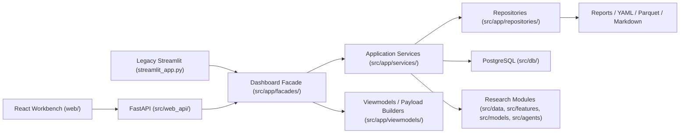
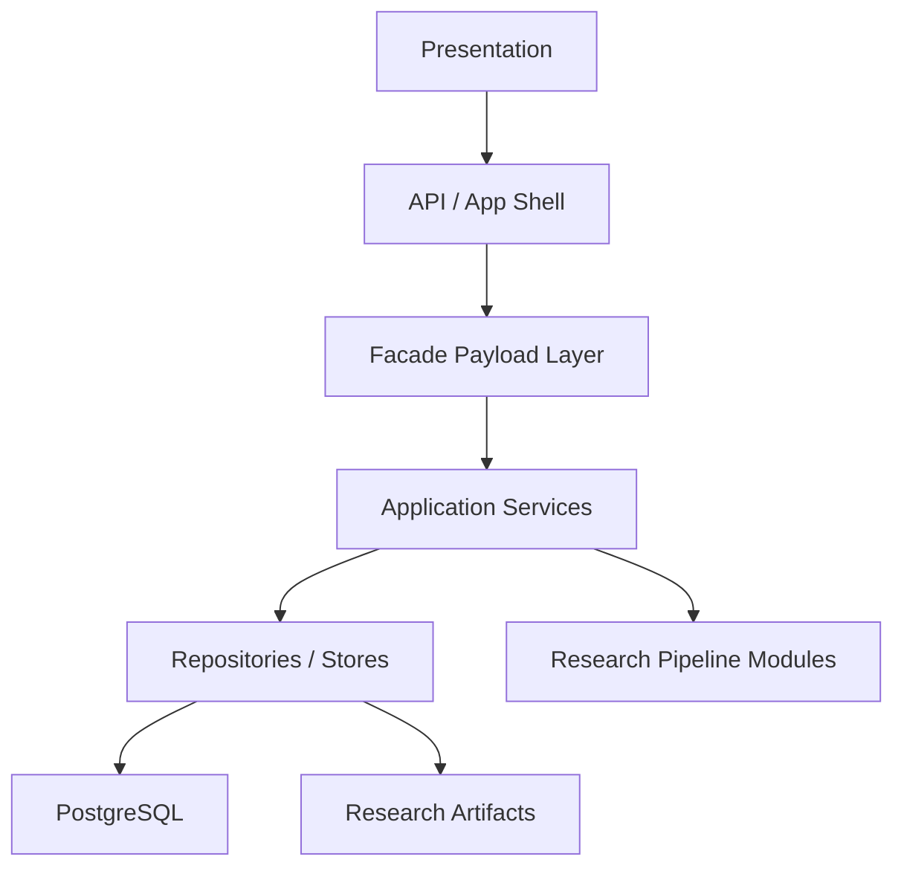

# System Architecture Blueprint

Date: `2026-04-04`

## Decision

Do not restart from scratch.

Continue on the current `React + FastAPI + shared facade + services + PostgreSQL` path, keep `Streamlit` only as a fallback and recovery surface, and stop adding new product-facing behavior to the legacy UI.

This is a controlled migration, not a rewrite.

## Why The UI Still Feels Messy

The main issue is not that the codebase has no modules.

The actual problem is that the repository is in the middle of a frontend migration:

- legacy `Streamlit` is still present
- the new `React` frontend is live
- `FastAPI` already exposes page payloads
- some business assembly still leaks across layers
- some helper logic still lived in page modules until this pass

That creates a middle state where the app works, but the structure still feels noisy.

## Current Production Shape

## Target Runtime Boundaries

## Layer Ownership

### 1. Presentation

- `web/src/`
- `streamlit_app.py`
- `src/app/pages/`
- `src/app/ui/`

Responsibility:

- route / page shell / interaction
- render payloads
- no direct business assembly
- no direct filesystem orchestration

### 2. API / App Shell

- `src/web_api/`

Responsibility:

- expose route contracts
- validate request parameters
- enforce auth
- call facade payload functions

### 3. Facade Payload Layer

- `src/app/facades/`
- `src/app/viewmodels/`

Responsibility:

- build page payloads
- normalize records for UI
- convert service outputs into stable API contracts

Rule:

- facades must not depend on page rendering modules

### 4. Application Services

- `src/app/services/`

Responsibility:

- watchlist assembly
- realtime quote orchestration
- runtime/service status
- dashboard data loading
- action execution and cache control

Rule:

- services own business workflows, not UI layout

### 5. Repositories / Stores

- `src/app/repositories/`
- `src/db/`

Responsibility:

- read and write persisted state
- database sync
- artifact access
- auth/session storage
- realtime snapshot storage

Rule:

- repositories do not know page concepts

### 6. Research Pipeline

- `src/data/`
- `src/features/`
- `src/models/`
- `src/backtest/`
- `src/agents/`

Responsibility:

- produce canonical research outputs
- train, infer, score, report

Rule:

- pipeline modules should not know frontend routes or frontend state

## What Changes Starting Now

### Keep

- existing React app
- existing FastAPI app
- existing database sync strategy
- existing Streamlit fallback

### Freeze

- no new product-facing features in `streamlit_app.py`
- no new page payload helpers inside `src/app/pages/*`

### Move Forward

- React becomes the primary operator UI
- FastAPI becomes the single source of page payloads
- shared facade/service contracts become the core integration seam

## Architecture Risks To Avoid

### 1. Page Modules Owning Data Assembly

This is already being corrected in this pass by moving payload helper functions into `src/app/viewmodels/`.

### 2. React And Streamlit Growing Separate Business Logic

Both UIs must consume the same facade/service outputs.

### 3. File Reads Spreading Back Into Presentation

All new file/database access should go through repositories or services.

### 4. Database Migration Without Contract Boundaries

Do not convert storage blindly.
Move read/write ownership into repositories first, then change backing storage behind them.

## Architecture Rule Set

1. New UI behavior goes into `web/` first, not `streamlit_app.py`.
2. New API behavior goes through `src/web_api/` and `src/app/facades/`.
3. New page payload logic goes into `src/app/viewmodels/` or `src/app/services/`, not `src/app/pages/`.
4. New persistence logic goes into `src/app/repositories/` or `src/db/`.
5. `Streamlit` remains available, but only for fallback and recovery.

## Immediate Phase-1 Status

Started in this pass:

- extracted reusable payload helper logic from page modules into:
  - `src/app/viewmodels/overview_vm.py`
  - `src/app/viewmodels/factor_explorer_vm.py`
  - `src/app/viewmodels/model_backtest_vm.py`
  - `src/app/viewmodels/candidates_vm.py`
- updated `src/app/facades/dashboard_facade.py` to depend on viewmodels instead of page modules

That is the first concrete step toward the target boundary model above.
